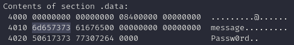

# Buffer Overflow Vulnerability

## Vulnerabilities

- deprecated unsafe I/O functions e.g. `gets`, `strcpy`, etc.
- information hard-coded in strings (`.rodata`)

## Inspection of Compiled Binaries

- Inspect all sections by using `objdump -s bufftest`.
- Display strings `readelf -x '.rodata' bufftest`
- Look at the symbol table by `readelf --symbols bufftest` or `objdump --syms bufftest`

## Buffer Overflow Test

Stored password works until the buffer is overrun by the string copy.


```sh
❯ ./overrun Passw0rd 0123456789abcde
Correct!
0123456789abcde
```

The password comparison starts to fail the very moment the caopied string overflows into the next buffer residing next to it.

```sh
❯ ./overrun Passw0rd 0123456789abcdef
Incorrect. :(
```
From here on, whatever string you suffix to the buffer compares successfully as a password.

```sh
❯ ./overrun DEAD 0123456789abcdefDEAD
Correct!
0123456789abcdefDEAD
```


## Explanation

After inspecting data section of the binary, using `objdump`, it becomes clear that the starting addresses of the 



two strings `buffer` and `password` are exactly 16 bytes apart. Hence any string longer than 16 characters shall overwrite the contents of the memory pointed by `password`. This vulnerability can be exploited to overwrite the hard-coded password field. 

